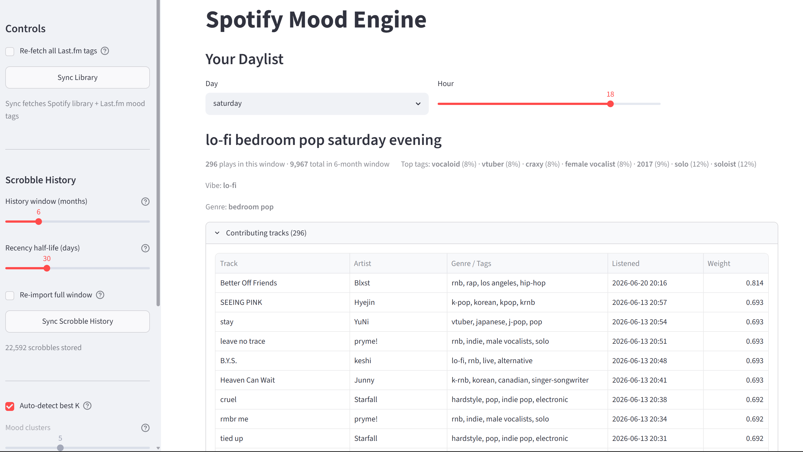

# Spotify Mood Engine

Spotify Mood Engine is a personal portfolio project that analyzes your Spotify listening history, groups your tracks into mood-based clusters, and generates playlists that match how you feel right now. It connects to your Spotify account, enriches your library with crowd-sourced genre tags from Last.fm, runs K-means clustering over that tag vocabulary, infers your current mood from what you tend to listen to at this hour of the day, and writes the resulting playlist directly back to your Spotify account. It also had to adapt twice to Spotify API deprecations mid-build, which shaped several of the architectural decisions described below.



## How It Works

After you connect with Spotify via OAuth, the app syncs your library in three passes: it pages through all of your Liked Songs, fetches your top tracks across Spotify's short-, medium-, and long-term time ranges, and pulls the last 50 recently played tracks along with their timestamps. For every track it encounters, it fetches the artist's genre tags from Spotify in batches of up to 50 artists per API call, then optionally enriches each track with crowd-sourced tags from Last.fm using a three-tier fallback: track-level tags first, artist-level tags if those come back empty, and the existing Spotify genres as a final fallback. All of this is persisted to a local SQLite database so subsequent syncs only fetch what's new.

Once your library is synced, Re-cluster builds a one-hot feature matrix over the top 50 tags across your entire library (merging Spotify genres and Last.fm tags into a unified vocabulary per track), scales it with `StandardScaler`, and sweeps K from 2 to 10, selecting the value that maximizes the silhouette score. The winning K-means model is then applied, and each cluster is labelled by matching its dominant centroid tags against a priority-ordered set of mood rules. For visualization, the same feature matrix is projected to two dimensions via PCA and displayed as a scatter plot with a companion bar chart showing the top tags per cluster.

Mood inference runs every time the sidebar renders: it looks at your listening history within a ±2-hour window of the current hour, finds the most common cluster among those plays, and surfaces it as a "Current Mood" metric. When you click **Create Playlist on Spotify**, the app randomly shuffles the tracks belonging to the selected cluster, creates or replaces a playlist named `Mood Engine: <label>` in your Spotify account, and returns a direct link.

The app can also import your full Last.fm scrobble history (up to 24 months) via the **Sync Scrobble History** button. Scrobbles are matched to library tracks by artist and title so they inherit the same Last.fm tags used for clustering. From this data, the **Daylist** feature computes a mood + genre descriptor for any hour of any day of the week. Rather than surfacing your all-time most-played tags, it uses a relative-lift approach: each tag's share in the target time window is divided by its global share across the full history, so the descriptor reflects what you distinctively listen to at that moment rather than what dominates your library overall. A configurable exponential decay weight (half-life in days) further emphasises recent listening over older history. The result is a 168-cell (7 days × 24 hours) grid of descriptors — for example, "ambient j-pop tuesday midday" or "techno saturday late night" — each backed by the contributing track list and fallback-level metadata.

## Features

- OAuth login with Spotify — no passwords stored; tokens cached locally
- Full library sync: Liked Songs (all pages), top tracks (three time ranges), recently played
- Batch artist genre enrichment via Spotify's multi-artist endpoint
- Last.fm tag enrichment with three-tier fallback and a non-semantic tag blocklist
- Automatic mood cluster discovery using K-means with silhouette-optimized K selection (auto-sweep 2–10, or manual override)
- PCA scatter plot of your library coloured by mood cluster
- Top-tags-per-cluster bar chart reflecting both Spotify genres and Last.fm tags
- Time-of-day mood inference from your listening history
- One-click playlist creation or replacement on your Spotify account
- Incremental syncs — only fetches tags for tracks that haven't been enriched yet
- Last.fm scrobble history import (up to 24 months, incremental) with exponential time-decay weighting
- Personalized daylist: derives a mood + genre descriptor for every hour of the week from your scrobble patterns using relative-lift scoring

## Tech Stack

| Library / Tool | Purpose |
|---|---|
| Python 3.11 | Runtime |
| [Streamlit](https://streamlit.io) | Web UI and session state |
| [Spotipy](https://spotipy.readthedocs.io) | Spotify Web API client and OAuth |
| [SQLAlchemy](https://www.sqlalchemy.org) | ORM; SQLite persistence |
| [scikit-learn](https://scikit-learn.org) | K-means, PCA, StandardScaler, silhouette scoring |
| [pandas](https://pandas.pydata.org) | DataFrames for track/history data |
| [Plotly](https://plotly.com/python/) | Interactive scatter and bar charts |
| [requests](https://requests.readthedocs.io) | Last.fm REST API calls |
| [python-dotenv](https://pypi.org/project/python-dotenv/) | `.env` loading |
| SQLite | Local database (`data/mood_engine.db`) |

## Key Technical Decisions

**K-means with silhouette scoring for cluster selection.** Rather than requiring the user to pick a number of clusters, the app sweeps K from 2 to 10, fits a K-means model at each value, and computes the silhouette score — a measure of how well-separated clusters are relative to how cohesive they are internally. The K with the highest score wins. The number of distinct moods in a library varies by person, so asking the user to pick K upfront would be a bad experience. Silhouette scoring tends to land in the 2–6 range for typical libraries, which matches the granularity of the mood labels.

**Last.fm integration with a three-tier fallback hierarchy for tag enrichment.** Spotify's artist genre tags are artist-level, not track-level, and tend to be sparse for newer or niche artists. Last.fm's crowd-sourced tags are track-level and often carry mood language ("melancholic", "rainy day", "focus") that genre strings alone don't capture. The enrichment logic tries `track.getTopTags` first, falls back to `artist.getTopTags` if that returns nothing, and falls back further to the Spotify genres already on the track if the artist lookup also returns nothing. Tags below a count threshold of 25 (out of 100) are discarded as too low-confidence, and a blocklist of 18 non-semantic tags ("favourite", "seen live", "awesome", etc.) prevents subjective listener annotations from polluting the feature vocabulary. All results are memoized in a process-lifetime dict so that repeated syncs don't re-fetch tags for tracks the database already has.

**Time-of-day mood inference using listening history.** The "Current Mood" metric is not a static cluster assignment — it uses the `listening_history` table, which records a timestamp for every recently played track. At render time, the app takes the current hour, constructs a ±2-hour window, filters the listening history to that window, joins against the clustered track table, and returns the modal cluster among those plays. This gives a personalized signal: if you habitually listen to lo-fi in the late afternoon, the app will infer that mood at that time even if your overall library is dominated by something else. The inference falls back to the library-wide modal cluster when the history window is empty.

**Library-first playlist generation.** Playlists are built entirely from the user's own library. Tracks belonging to the selected cluster are randomly shuffled and trimmed to the requested size (default 30, maximum 100). The random shuffle rather than any ranking avoids the playlist feeling repetitive across regenerations. The app searches the user's existing playlists by name before creating a new one, so re-generating a mood playlist overwrites the previous version rather than creating duplicates.

**Imputation of empty-tag tracks in the feature matrix.** Tracks with no Spotify genres and no Last.fm tags would otherwise form a zero-vector row in the feature matrix, which K-means would collect into a spurious "unknown" cluster. Instead, these tracks are imputed with a weight of 0.1 (versus 1.0 for a known tag) across the three most common tags in the library. This gives empty-tag tracks a faint affinity toward the library's dominant moods without overpowering them — they will be pulled into a real cluster rather than forming their own, while still having less influence on centroids than tagged tracks.

## Navigating Spotify API Deprecations

**Audio features endpoint restricted (November 2024).** The original design of this project used Spotify's `/v1/audio-features` endpoint as the primary clustering signal — valence, energy, danceability, tempo, and similar numeric descriptors per track. After Spotify restricted this endpoint to apps with Extended Quota access (which requires manual approval), that approach became unavailable for development-mode apps. The schema still shows traces of this original intent: an `AudioFeatures` table and centroid audio columns in `Cluster` are documented in the audit history as dead schema weight that was never populated and was subsequently removed. The project pivoted to clustering on genre and Last.fm tag vocabularies instead. Genre and tag strings carry semantic meaning that maps directly to mood labels, which works better for this use case than the abstract numeric axes of valence and energy.

**Recommendations endpoint and track popularity signal removed (February 2026).** The second major deprecation removed `sp.recommendations()` for Development mode apps and degraded the reliability of the `popularity` field on track objects. The original app had a catalog expansion feature: after filling the playlist with library tracks, it would call `sp.recommendations()` seeded with a few tracks from the cluster and pad the playlist to the target size with Spotify catalog suggestions. When that endpoint was restricted, the expansion logic was removed entirely rather than left as a dead code path — the app now generates playlists solely from the user's library. Separately, `popularity` had been used as a feature in the clustering matrix and as a ranking signal for playlist ordering; with the field often returning 0 for unsynced tracks, it was unreliable even before the deprecation, so it was removed as a cluster feature and replaced with random shuffling for playlist ordering.

## Known Limitations

- **50-track recently played cap.** The Spotify API returns at most 50 recently played tracks, regardless of time range. The time-of-day mood inference is based on this thin window, so for users who listen to a lot of music, it may only cover the last few hours rather than a meaningful historical sample.
- **Last.fm tag sparsity for niche and new artists.** The Last.fm tag database has good coverage for established artists but poor coverage for newer, regional, or niche acts. Tracks by those artists fall through to the Spotify genre fallback or the imputation path, which means they cluster less precisely.
- **Mood labels are heuristic, not learned.** Cluster labels are assigned by matching the cluster's dominant tags against a hand-written priority-ordered rule list. The mapping reflects reasonable genre-to-mood associations but is not derived from any ground truth or user feedback. Two clusters with similar genre compositions but different dominant tags can end up with different labels, and "Mixed" is the fallback for anything that doesn't match.
- **Single-user local deployment.** The SQLite database and OAuth token cache are stored locally and are not designed for concurrent multi-user access.

## Setup & Installation

**Prerequisites**

- Python 3.11
- A [Spotify Developer](https://developer.spotify.com/dashboard) app with a redirect URI configured
- A [Last.fm API account](https://www.last.fm/api/account/create) (optional, but recommended — without it, clustering uses Spotify genres only)

**Clone and create a virtual environment**

```powershell
git clone <repo-url>
cd spotify-mood-engine
python -m venv venv
.\venv\Scripts\Activate.ps1
```

**Install dependencies**

```powershell
pip install -r requirements.txt
```

**Configure environment variables**

Create a `.env` file in the project root:

```env
SPOTIPY_CLIENT_ID=your_spotify_client_id_here
SPOTIPY_CLIENT_SECRET=your_spotify_client_secret_here
SPOTIPY_REDIRECT_URI=http://localhost:8501
LASTFM_API_KEY=your_lastfm_api_key_here
```

- `SPOTIPY_CLIENT_ID` / `SPOTIPY_CLIENT_SECRET`: from your app's settings page on the [Spotify Developer Dashboard](https://developer.spotify.com/dashboard). Add `http://localhost:8501` as an allowed redirect URI in that same settings page.
- `SPOTIPY_REDIRECT_URI`: must match exactly what you registered on the Dashboard. Use `http://localhost:8501` for local development with the default Streamlit port.
- `LASTFM_API_KEY`: from [last.fm/api/account/create](https://www.last.fm/api/account/create). Free, no rate-limit approval required. If omitted, Last.fm enrichment is skipped and a warning banner appears in the sidebar.

**Run the app**

```powershell
streamlit run main.py
```

The browser will open at `http://localhost:8501`. Click **Connect with Spotify**, complete the OAuth flow, then click **Sync Library** in the sidebar followed by **Re-cluster**.

## Project Structure

```
spotify-mood-engine/
├── main.py                  # Entry point — configures logging, calls app.ui.main()
├── requirements.txt         # Pinned package versions
├── .env                     # API keys (not committed)
│
├── app/
│   ├── auth.py              # Spotify OAuth: token management, URL generation, code exchange
│   ├── fetch.py             # Library sync, batch genre enrichment, Last.fm tag/scrobble enrichment
│   ├── cluster.py           # Feature matrix, K selection, K-means, mood labelling, PCA
│   ├── daylist.py           # Temporal listening analysis: relative-lift scoring, 7×24 hour grid
│   ├── recommend.py         # Playlist assembly and Spotify playlist push
│   ├── database.py          # SQLAlchemy engine, session factory, schema migrations
│   ├── models.py            # SQLAlchemy models: User, Track, ListeningHistory, ScrobbleHistory, Cluster
│   └── ui.py                # Streamlit page layout, OAuth callback handling, chart rendering
│
├── tests/
│   ├── smoke.py             # End-to-end clustering pipeline smoke test (no credentials needed)
│   └── test_fetch.py        # Unit tests for batch genre enrichment (_enrich_genres_batch)
│
└── data/
    └── mood_engine.db       # SQLite database (gitignored; created on first run)
```

